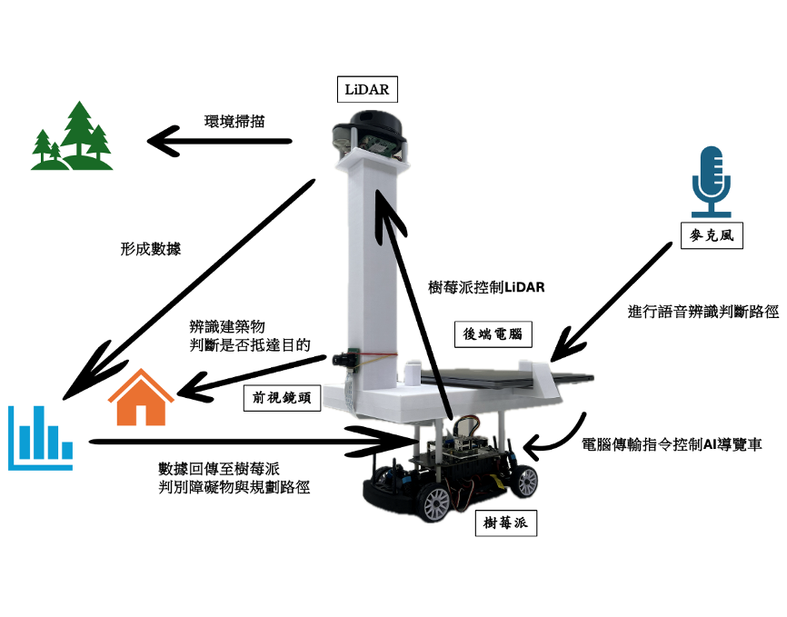
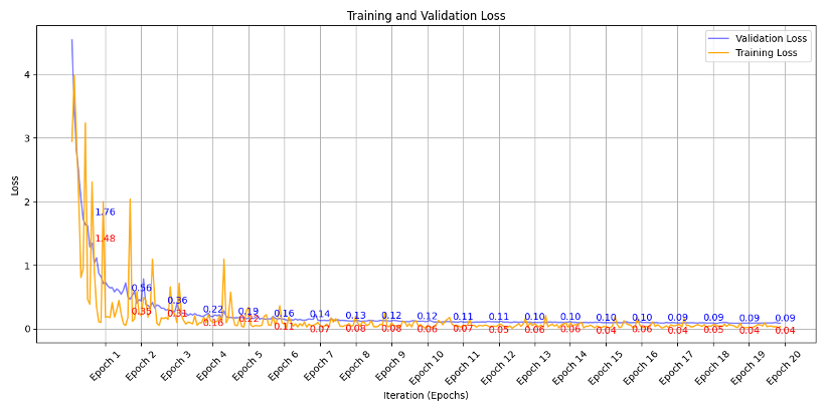
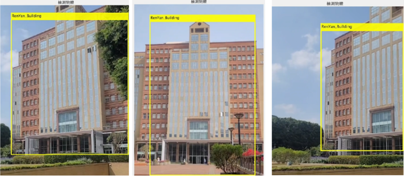
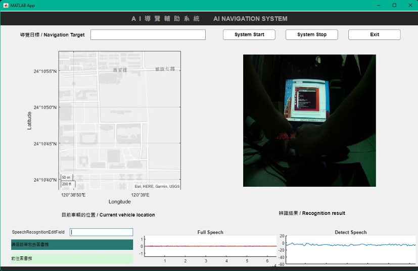

# AI Navigation Assistance System  
AI 導覽輔助系統

本專題以「自動化導覽車」為核心，整合 SLAM 建圖、路徑規劃、YOLO 建築辨識、語音導覽與跨平台控制，實現能在校園中自主移動、辨識建築並提供導覽資訊的智慧型導航系統。

---

## 📌 專案特色（Key Features）

### 🔹 LiDAR SLAM 建圖  
- 使用 **Hector SLAM**（ROS Noetic）
- 自行調整解析度、更新頻率、匹配參數
- 解決漂移與定位不穩等問題，使地圖可穩定用於導航

### 🔹 路徑規劃與避障  
- 使用 **D\* Lite** 作全局路徑規劃
- 使用 **DWA** 作局部避障
- 針對校園環境調整速度、安全距離、權重
- 改善轉彎不足、抖動、邊緣避障不靈敏等問題

### 🔹 YOLOv4 建築辨識
- 自行蒐集並標註 **4500+ 校園建築照片**
- 使用 **CSPDarknet53** 進行訓練
- 模型整合至樹梅派端，讓導航車能辨識校園建築物

### 🔹 跨平台整合（Raspberry Pi + Arduino + MATLAB）
- Pi 負責 SLAM / YOLO / 系統控制
- Arduino 控制底盤驅動、馬達、速度
- MATLAB GUI 進行監控（地圖、影像、偵測結果）
- 打通 Pi → PC → Arduino 的資料流與操作流程

### 🔹 自主移動與語音導覽
- 自主導航至目標建築
- 到達後觸發語音播放導覽資訊

---

## 🖥️ 系統架構（System Architecture）

架構包含：

- 感測層：RPLIDAR、Camera  
- 感知層：SLAM / YOLO  
- 規劃層：D\* Lite + DWA  
- 控制層：Arduino 馬達控制  
- 介面層：MATLAB GUI  
- 導覽層：語音播放與建築說明  

---

## 🎥 成果展示（Demo & Output）

以下為系統運作的部分成果：

### Robot 運行畫面   

### YOLO 訓練損失軌跡圖

### YOLO 辨識結果

### GUI 介面

---

## 🚀 技術內容（Technical Details）

### 1. SLAM  
- Hector mapping（無需 odometry）  
- 針對校園室內外複合環境調整匹配敏感度  
- 解決漂移、重定位反應慢等問題

### 2. 路徑規劃 + 避障  
- D\* Lite：動態地圖下可重規劃  
- DWA：依障礙物距離、速度、方向，計算最佳控制量  
- 自行調校避障參數，使其更符合實地行走需求

### 3. YOLOv4  
- 自建 4500+ 建築 dataset（教學大樓、宿舍、學餐等）  
- 使用 LabelImg 完成 bounding box 標註  
- CSPDarknet53 backbone  
- 訓練至 loss 收斂並完成部署

### 4. Raspberry Pi + Arduino  
- UART 通訊  
- Pi：SLAM, YOLO, 控制指令  
- Arduino：PWM 控速、方向控制、驅動 L298N

### 5. MATLAB GUI  
- 顯示 SLAM 地圖 + 車體位置  
- 顯示 YOLO 偵測結果  
- 顯示即時影像與系統狀態  
- 支援手動與自動模式切換
