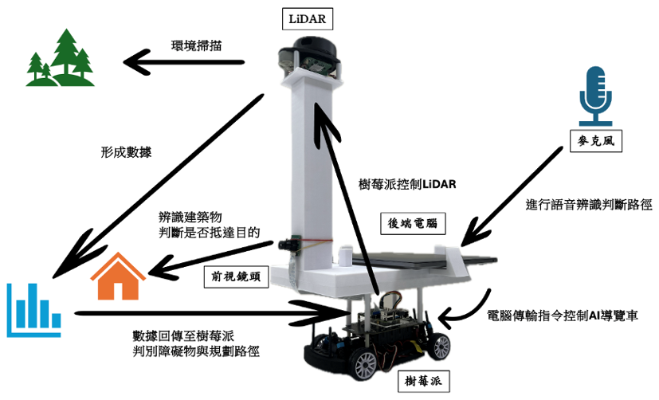

# AI Navigation Assistance System  
Autonomous Campus Navigation & Building Recognition Robot

This project presents an autonomous navigation assistant vehicle capable of performing SLAM mapping, path planning, YOLO-based building recognition, voice-guided introduction, and cross-platform system integration.
The system is designed for campus environments, enabling the robot to autonomously navigate to buildings, recognize landmarks, and provide guided information.

---

🎥 Demo Video: https://www.youtube.com/watch?v=_xXVmry_xc8
🏆 2024 National University Smart Innovation Competition — Special Recognition Award

---

## 📦 Downloads

Documents and deliverables related to this project:

| File Name | Description | Download |
|---------|------|------|
| **NAS_Documentation.pdf** | Full project documentation (architecture, workflow, technical details) | [Download](./docs/NAS_Documentation.pdf) |
| **NAS_Poster.pdf** | Project poster (presentation version) | [Download](./docs/NAS_Poster.pdf) |

---

## 📌 Key Features

### 🔹 LiDAR SLAM Mapping
- Implemented using Hector SLAM (ROS Noetic)
- Custom-tuned resolution, scan update rate, and matching sensitivity
- Resolved drift and unstable localization issues to ensure reliable navigation-quality maps

### 🔹 Path Planning & Obstacle Avoidance
- D* Lite for global path planning
- DWA (Dynamic Window Approach) for local obstacle avoidance
- Tuned motion parameters for campus hallways and corners
- Improved cornering, reduced path oscillation, and optimized edge detection

### 🔹 YOLOv4 Building Recognition
- Collected and labeled 4500+ images of campus buildings
- Trained with CSPDarknet53 backbone
- Integrated into Raspberry Pi for real-time building identification

### 🔹 Cross-Platform Integration
- Raspberry Pi: SLAM, YOLO, high-level control
- Arduino: Motor PWM control, speed and steering
- MATLAB GUI: Monitoring (SLAM map, detections, live stream)
- Ensured seamless Pi → PC → Arduino data flow

### 🔹 Autonomous Navigation with Voice Guide
- Robot autonomously navigates to a selected building
- Upon arrival, the system plays an audio description of the location

---

## 🖥️ System Architecture

Architecture includes:

- Sensing Layer: RPLIDAR, camera
- Perception Layer: SLAM, YOLO detection
- Planning Layer: D* Lite global planner + DWA local planner
- Control Layer: Arduino motor controller
- Interface Layer: MATLAB GUI
- Guide Layer: Voice introduction module

---

## 🎥 Demo & Output

Representative results and system outputs:

### Robot Operation   

### YOLO Training Loss Curve

### YOLO Detection Results

### System GUI

---

## 🚀 Technical Details

### 1. SLAM
- Hector mapping (no odometry required)
- Tuned for mixed indoor–outdoor campus conditions
- Solved drift, poor relocalization, and unstable map updates

### 2. Path Planning & Obstacle Avoidance
- D* Lite: Dynamic map-aware replanning
- DWA: Computes optimal velocity commands based on obstacle distance and heading
- Fine-tuned for smoother, safer navigation in narrow hallways

### 3. YOLOv4  
- Custom dataset with 4500+ labeled building images
- Labeled using LabelImg
- CSPDarknet53 backbone
- Trained until convergence and deployed on Raspberry Pi

### 4. Raspberry Pi + Arduino  
- UART communication
- Raspberry Pi: SLAM, YOLO, command generation
- Arduino: PWM speed control, direction control, L298N motor driver

### 5. MATLAB GUI  
- Displays SLAM map & robot pose
- Shows YOLO detection results
- Live video feed & status monitoring
- Supports both manual and autonomous modes
